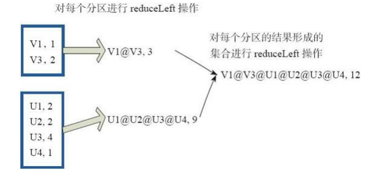
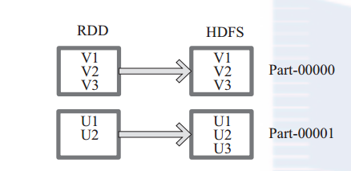

## <center><font color=#5C4033>Spark常用transformations算子</font></center>

### <font color=#FF7F00>reduce</font>
> reduce将RDD中元素两两传递给输入函数，同时产生一个新值，新值与RDD中下一个元素再被传递给输入函数，直到最后只有一个值为止。


### <font color=#FF7F00>collect</font>
> 将RDD的数据收集到driver端。数据量大的数据会报OOM。通常用take来代替。

### <font color=#FF7F00>take</font>
> 返回一个包含数据集前n个元素的数组，不排序。

### <font color=#FF7F00>aggregate</font>
> def aggregate[U: ClassTag](zeroValue: U)(seqOp: (U,T) => U, combOp: (U,U) => U):U
> aggregate方法可以对两个不同类型的元素进行聚合，即支持异构。它先聚集每一个分区里的元素，然后将所有的结果返回回来，再用一个给定的combine方法以及给定的初始值zero value进行聚合。
> seqOp相当于是在各个分区里进行的聚合操作，它支持(U, T) =>,也就是支持不同类型的聚合。
> combOp是将seqOp后的结果再进行聚合，此时的结果全部是U类，只能进行同构聚合。


### <font color=#FF7F00>countByKey</font>
> 计算每一个key的元素个数，并且把结果保存到一个Map中
> 思路很简单，就是先把RDD中的value都变成1，然后reduceByKey，再通过collect行动算子拉取到driver，最后toMap转换成一个Map类型。
源码
```scala
  def countByKey(): Map[K, Long] = self.withScope {
    self.mapValues(_ => 1L).reduceByKey(_ + _).collect().toMap
  }
```
[参考链接](https://www.jianshu.com/p/9b39350fddcb)


### <font color=#FF7F00>forearch</font>
> def foreach(f: (T) ⇒ Unit): Unit
> 用于遍历RDD，将函数f应用于每一个元素。


### <font color=#FF7F00>saveAsTextFile</font>
> 函数将数据输出，存储到 HDFS 的指定目录。将 RDD 中的每个元素映射转变为 (null， x.toString)，然后再将其写入 HDFS。
> 图 中左侧方框代表 RDD 分区，右侧方框代表 HDFS 的 Block。通过函数将RDD 的每个分区存储为 HDFS 中的一个 Block



### <font color=#FF7F00>参考链接</font>
[Spark官网](http://spark.apache.org/docs/latest/rdd-programming-guide.html#actions)

